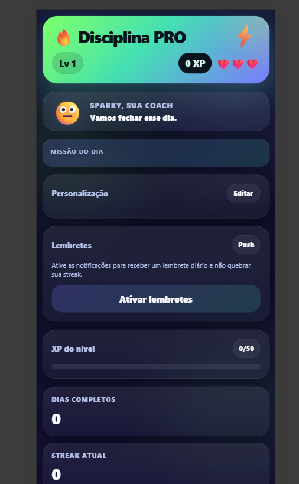

# Disciplina PRO 🚀

> Um Progressive Web App (PWA) gamificado de 30 dias para construir hábitos e disciplina com missões, XP e streaks.

Este projeto foi criado para ser um companheiro na jornada de construção de disciplina. Ele transforma o processo de seguir metas diárias em um jogo, utilizando elementos como XP (pontos de experiência), níveis e streaks (sequências) para manter a motivação em alta.

---

## ✨ Features

- **Gamificação Completa:** Ganhe XP, suba de nível e mantenha sua *streak* de dias consecutivos para se manter engajado.
- **Checklist 100% Personalizável:** Edite, adicione, remova e reordene suas metas diárias a qualquer momento.
- **Progressive Web App (PWA):** Instale o app diretamente na tela inicial do seu celular (Android/iOS) e use-o offline, como um aplicativo nativo.
- **Design Moderno e Responsivo:** Interface bonita e funcional que se adapta perfeitamente a qualquer tamanho de tela.
- **Suporte a Múltiplos Idiomas:** Interface disponível em Português e Inglês (detecção automática).
- **Notificações Push:** Ative lembretes diários para nunca mais esquecer de completar suas metas.
- **Zero Dependências:** Construído com HTML, CSS e JavaScript puros. Não requer backend, banco de dados ou bibliotecas externas.
- **Tudo Local:** Seu progresso é salvo diretamente no seu dispositivo, garantindo privacidade e funcionamento offline.

---

## 🛠️ Tecnologias Utilizadas

O projeto foi construído do zero utilizando apenas as tecnologias essenciais da web:

- **HTML5**
- **CSS3** (com Variáveis, Flexbox e Grid)
- **JavaScript (ES6+)** (Vanilla JS, sem frameworks)
- **Service Workers** (para a funcionalidade PWA e cache offline)
- **Web App Manifest**

---

## 🚀 Como Usar

O aplicativo foi projetado para ser extremamente simples de usar.

1.  **Acesse o link** da aplicação no seu navegador (preferencialmente no celular).
2.  O app irá sugerir a instalação. Clique em **"Instalar"** ou use a opção **"Adicionar à Tela de Início"** do seu navegador.
3.  Pronto! O ícone do "Disciplina PRO" aparecerá na sua lista de apps, e você poderá usá-lo a qualquer momento, mesmo sem internet.

---

## 🤝 Contribuição

Este é um projeto de código aberto e contribuições são bem-vindas. Se você tem ideias para novas funcionalidades, melhorias de design ou correções de bugs, sinta-se à vontade para:

1.  Fazer um **Fork** do repositório.
2.  Criar uma nova **Branch** (`git checkout -b feature/sua-feature`).
3.  Fazer o **Commit** das suas alterações (`git commit -m 'Adiciona sua feature'`).
4.  Enviar para a sua Branch (`git push origin feature/sua-feature`).
5.  Abrir um **Pull Request**.

---

## 📄 Licença

Este projeto está sob a licença MIT. Sugiro criar um arquivo `LICENSE` no seu repositório com o conteúdo da licença MIT.

---

*Feito com ❤️ e código para ajudar a construir disciplina.*